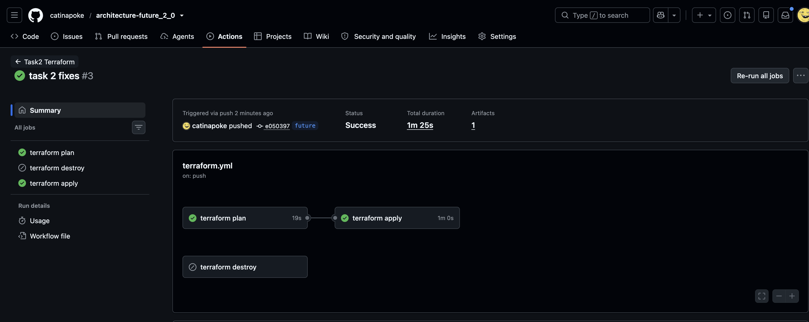

# Задание 2. CI/CD и удалённое состояние Terraform

В рамках задания 2 был создан бакет на Yandex Cloud для бекенда Terraform.

Конфиг прописан в `main.tf`: бакет `ya-p-bucket`, ключ объекта `state/terraform.tfstate`. 
Ключи доступа бакета хранятся в переменных окружения `ACCESS_KEY` / `SECRET_KEY`.

Ключ провайдера Yandex Cloud тоже в переменных окружения: `YC_CLOUD_ID`, `YC_FOLDER_ID` и ключ сервисного аккаунта.

Пайплайн настроен для Github Actions на рабочую ветку future. Выполняется init, plan и apply. Вообще правильно такое делать по кнопке, но из-за ограничения github actions это нельзя сделать без мержа в мейн, поэтому так. 

Apply берёт именно тот plan-файл, который только что собрала джоба `plan` (артефакт живёт 1 день). Применяется ровно то, что было в plan.

`concurrency.group: terraform-task2` не даёт двум apply идти параллельно и портить state.

Workflow лежит в `.github/workflows/`, а не внутри `Task2Advanced` для работы GitHub Actions.



# Секреты

| Secret | Что туда положить |
|---|---|
| `YC_SA_KEY` | Содержимое JSON ключа сервисного аккаунта целиком |
| `YC_CLOUD_ID` | ID облака |
| `YC_FOLDER_ID` | ID каталога |
| `ACCESS_KEY` | Access key статического ключа Object Storage |
| `SECRET_KEY` | Secret key статического ключа Object Storage |
| `TF_VAR_SSH_KEY` | `someuser:ssh-ed25519 AAAA...` (или `ssh-rsa`) |

Получить ключи можно по гайдам:
Создание сервисного аккаунта и получение ID облака и каталога - https://yandex.cloud/ru/docs/tutorials/infrastructure-management/terraform-state-storage#create-service-account
Статический ключ - https://yandex.cloud/ru/docs/iam/operations/authentication/manage-access-keys#create-access-key
Бакет - https://yandex.cloud/ru/docs/storage/operations/buckets/create


---

## Локальный запуск


```bash

export ACCESS_KEY=...          # статический ключ бакета
export SECRET_KEY=...
export YC_CLOUD_ID=...
export YC_FOLDER_ID=...
export YC_SERVICE_ACCOUNT_KEY_FILE=/absolute/path/to/sa-key.json

# отредактировать, чтобы затем можно было запускать terraform plan -var-file=./envs/dev/terraform.tfvars
cp envs/dev/terraform.tfvars.example envs/dev/terraform.tfvars

# опционально, если публичный ключ не в ~/.ssh/cloudru.pub:
# export TF_VAR_ssh_key='ubuntu:ssh-ed25519 AAAA...'

make init
make plan
make apply
```
