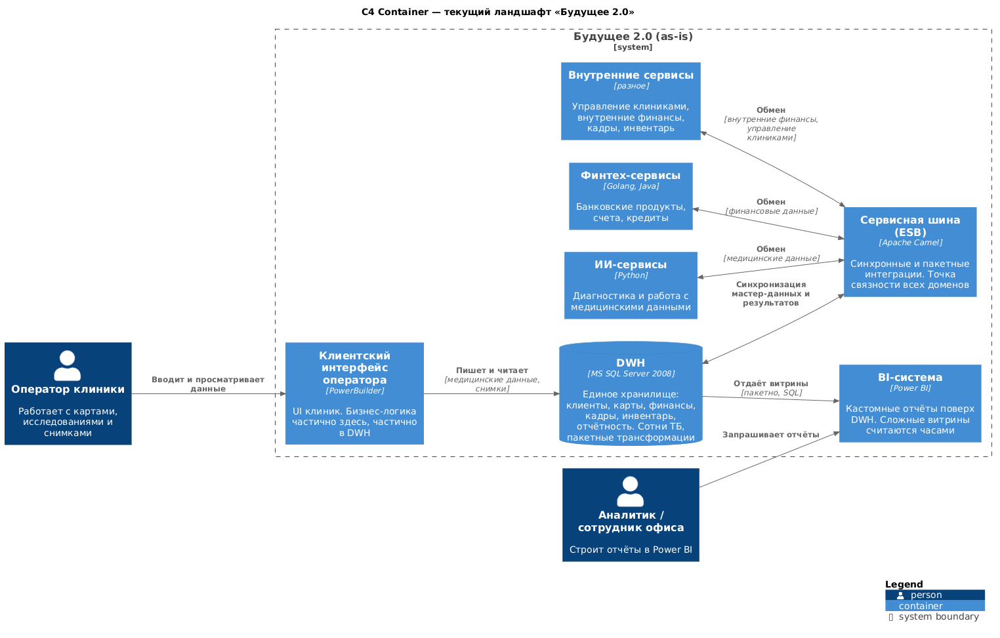
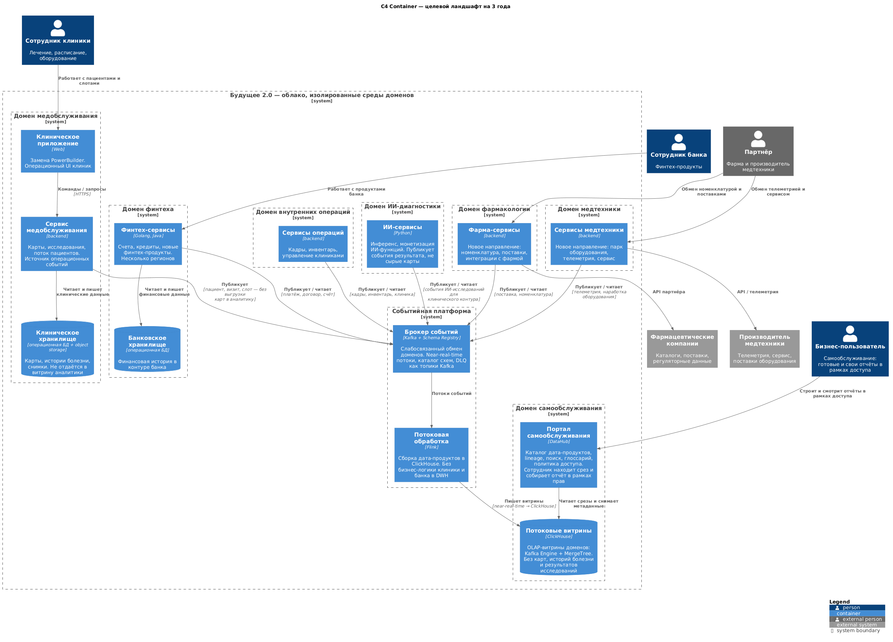
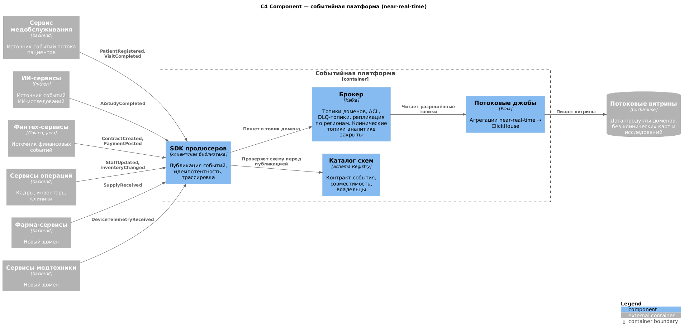

# Задание 3

Для решения задания нужно вначале определить что есть сейчас и что поменяется. 

Сейчас: 

- DWH на базе Microsoft SQL-сервера 2008 года;
- Power BI;
- Power Builder;
- ESB на базе Apache Camel;
- ИИ-сервисы на Python;
- Финтех-сервисы на Golang и Java.

Что поменяется после трех лет:

- запуск новых финтех- и медицинских сервисов, монетизация ИИ-функций.
- увеличение количества источников и событий, переход от пакетной отчётности («batch») к near-real-time обработке.
- реализация портала самообслуживания для сотрудников
- Слабосвязанная событийная платформа, в рамках которой домены взаимодействуют через события и реактивные потоки. Интеграции через шину Camel и DWH не используются

Какие домены сейчас видны:

- Домен медобслуживания
- Домен ИИ определения диагноза
- Домен финтеха
- Домен внутренних операций
- Домен фармакологии
- Домен работы с мед техникой
- Домен аналитики
- Домен медобслуживания
- Домен ИИ определения диагноза

Теперь можно описать C4 диаграмму. 

As-is Containers

To-be Containers

To-be работа с событиями

# Карта рисков трансформации «Будущее 2.0»

Какие вообще есть потенциальные проблемы:

1. Следуя из закона Конвея при неправильном разбиении на домены мы можем получить проблемы с организацией разработки, что может выльиться в техдолг + затруднит внедрение Data Mesh, где каждый домен отвечает за свои данные. Точно же исходя из предоставленных данных сейчас сложно сделать разбиение точнее.
2. В условиях задач сказано, что все взаимодействие должно быть построено на событиях. Однако, это не всегда хороший путь, поскольку это лишь инструмент и иногда нужно применять синхронные вызовы. Потенциально может привести к расхождениям в данных(бронирование слотов в клинике, финансовые операции), удлинением процессов.
3. Данных ожидается много и неверный учет размера хранилища данных может привести к потере данных и сбоям в процессах, которые построены на этих данных.
4. Проблемой также может являться некорректная оценка сроков переноса, при которой выезд с SQL Server 2008 и Apache Camel может затянуться и выльиться в дополнительные затраты на разработку и исправление инцидентов.
5. Так и наоборот слишком ранний выезд с легаси без всех необходимых проверок может повлечь за собой потери данных и репутации из-за сбоя на новом контуре.
6. При переезде между старым и новым контуром может появиться расхождение, которое стоит предусмотреть - алгоритм выявления расхождений и последующая синхронизация. Если не учесть, то грозит ошибками в логике работы.
7. Новая система может не выдержать новой нагрузки, если заранее не учесть ее. Это грозит сбоями -> потеря данных и репутации.
8. Утечка чувствительных данных является потенциальной проблемой, т.к. все взаимодействие происходит через брокер сообщений и при неверном выставлении ограничений данные могут попасть не в те руки. Также оно может и утечь в аналитические данные. Риск штрафов, утечек данных, потери репутации.
9. Дефицит компетенций - в компании может не оказаться людей с владением новыми инструментами, что замедлит внедрение и добавит рисков ошибок.

Распишем для каждой проблемы класс, вероятность и влияние. 

| Номер проблемы | Класс                           | Вероятность | Влияние |
| -------------- | ------------------------------- | ----------- | ------- |
| 1              | архитектурный / организационный | высокая     | высокое |
| 2              | архитектурный                   | высокая     | высокое |
| 3              | технологический                 | средняя     | высокое |
| 4              | организационный                 | высокая     | среднее |
| 5              | технологический                 | средняя     | высокое |
| 6              | архитектурный                   | высокая     | высокое |
| 7              | технологический                 | средняя     | высокое |
| 8              | технологический                 | средняя     | высокое |
| 9              | организационный                 | высокая     | среднее |

# Меры снижения рисков

| №   | Меры снижения                                                                                                                                                                                                                                                              |
| --- | -------------------------------------------------------------------------------------------------------------------------------------------------------------------------------------------------------------------------------------------------------------------------- |
| 1   | Необходимо провести уточнение доменов с бизнесом. Определить разбиение которые мы можем получить и постепенно смещать разбиение в эту сторону, при необходимости границы поправлять по ходу. Ответственность за данные отдать командам доменов, а не оставлять всё на DWH. |
| 2   | Для мест, где расхождения критичны (бронирование слотов, финансовые операции), оставить синхронные вызовы, а события использовать там, где задержка допустима.                                                                                                             |
| 3   | Расчитать размер хранилища с запасом под рост данных и настроить алерты на заполнения хранилища.                                                                                                                                                                           |
| 4   | Определить ожидаемый срок переезда, но сам переезд проводить поэтапно, где после каждого этапа уточнять все ли идет по плану и корректировать возникающие ошибки и сложности в переезде.                                                                                   |
| 5   | Не выезжать с легаси, пока новый контур не проверили. Сам переезд проводить постепенно на небольшом количество вызовов. Какое-то время держать оба контура параллельно.                                                                                                    |
| 6   | Сделать алгоритм выявления расхождений между старым и новым контуром и последующую синхронизацию.                                                                                                                                                                          |
| 7   | Определить ожидаемую нагрузку и проводить регулярные нагрузочные тесты.                                                                                                                                                                                                    |
| 8   | Выработать регламент предоставления доступов. Определить какие данные являются чувствительными и установить соответствующие ограничения на выдачу прав доступа к ним.                                                                                                      |
| 9   | До начала переезда нанять или обучить людей под новые инструменты, на старте можно привлечь тех, кто уже с этим работал.                                                                                                                                                   |

