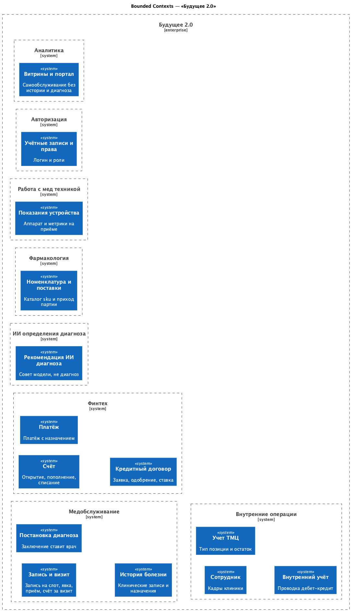
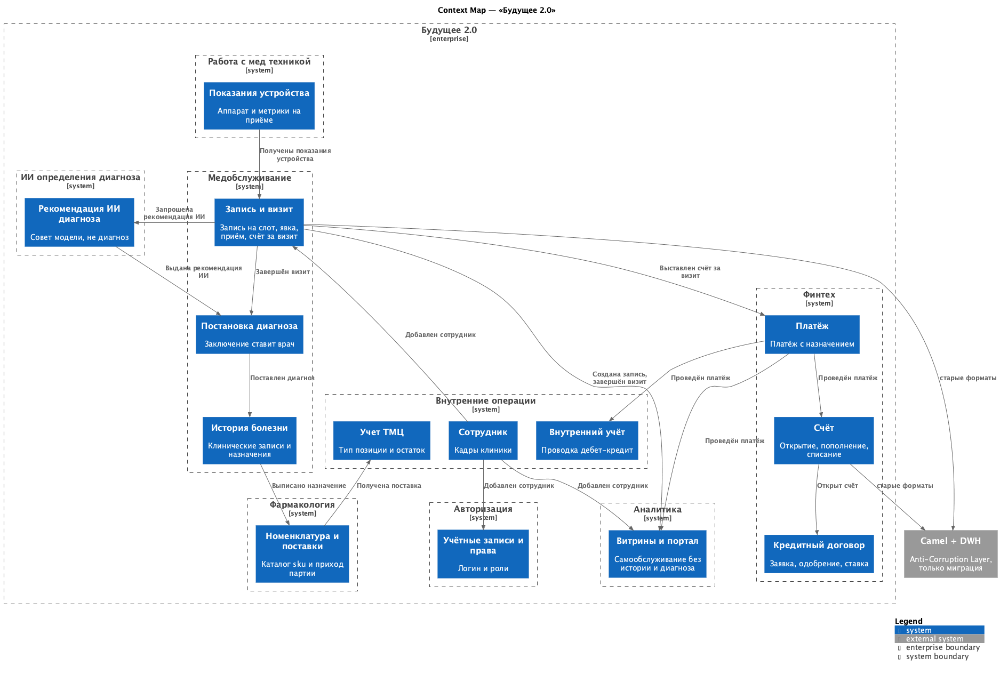

# Задание 4

Для решения нужно разделить систему на домены, описать агрегаты и события между ними.

Обоснование, зачем уходить с Camel и DWH на события описал в [justification.md](./justification.md) как сказано в задании.

Перепишем домены из третьего задания под DDD.

**Core**:
Домен: медобслуживание
- поддомен приема пациентов
    - контекст: запись и визит
- поддомен диагноза и истории болезни
    - контекст: постановка диагноза
    - контекст: история болезни

Домен: финтех
- поддомен счетов
    - контекст: счёт
    - контекст: платёж
- поддомен кредитов
    - контекст: кредитный договор

Домен: ИИ определения диагноза
- поддомен исследований
    - контекст: рекомендация ИИ диагноза

**Supporting**:
Домен: фармакология
- поддомен интеграции с фармой
    - контекст: номенклатура и поставки

Домен: работа с мед техникой
- поддомен интеграции с устройствами
    - контекст: показания устройства

Домен: внутренние операции
- поддомен управления кадрами
    - контекст: сотрудник
- поддомен управления ТМЦ
    - контекст: учет товарно-материальных ценностей
- поддомен бухгалтерии
    - контекст: внутренний учёт

**Generic**:
Домен: аналитика
- поддомен самообслуживания
    - контекст: витрины и портал

Домен: авторизация
- поддомен доступа
    - контекст: учётные записи и права

Аггрегаты описаны в файле [aggregates.md](./aggregates.md)

Диаграмма контекстов

Context Map
