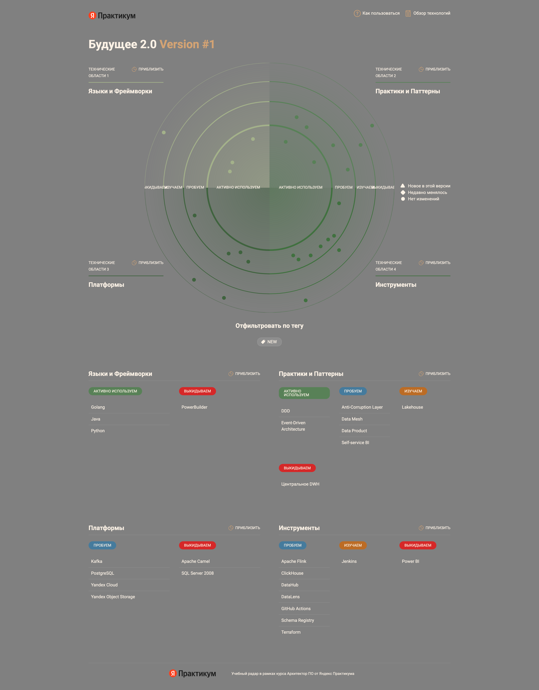

# Задание 5

# Целевой технологический стек

## Технологии

1. Python - Adopt. Уже используется в ИИ сервисах
2. Golang - Adopt. Уже используется во финтехе
3. Java - Adopt. Уже используется во финтехе
4. Yandex Cloud - Trial. Один из вариантов облака
5. Kafka - Trial. Брокер событий в целевом C4, в проде ещё нет
6. Schema Registry - Trial. Контракты событий и совместимость, обкатываем на пилоте
7. Apache Flink - Trial. Сборка потоковых витрин
8. ClickHouse - Trial. Витрины доменов
9. DataHub - Trial. Каталог и портал самообслуживания
10. DataLens - Trial. Конструктор отчётов к ClickHouse
11. Terraform - Trial. Удобен для разворачивания инфры
12. Yandex Object Storage - Trial.
13. GitHub Actions - Trial.
14. Jenkins - Assess. Запасной CI
15. PostgreSQL - Trial. Операционные БД доменов
16. PowerBuilder - Hold. Легаси UI клиник
17. SQL Server 2008 - Hold. Легаси
18. Apache Camel - Hold. Легаси
19. Power BI - Hold. Легаси

## Архитектурные паттерны

1. Data Mesh - Trial.
2. Event-Driven Architecture - Adopt. Утверждено
3. Self-service BI - Trial.
4. DDD - Adopt.
5. Anti-Corruption Layer - Trial. Для миграции с Camel и DWH
6. Data Product - Trial.
7. Lakehouse - Assess.
8. Центральное DWH - Hold. Узкое горлышко

# Экономическое обоснование трансформации

Посчитаем экономическое обоснование отталкиваясь от основных статей на затрат. Конретные цифры сложно сказать, поэтому выпишем изменения в каждой статье.

Основные статьи затрат:

1. Инфраструктура
2. Лицензии
3. Сопровождение
4. Время аналитиков

Сравним целевую с текущей:
Инфраструктура - Потребуется больше всего развернуть, но должны получить выйгрыш за счет того, что старая архитектура устаерла, а значит требует больше железа на тот же объем работы.

Лицензии - ранее были продукты от Microsoft, сейчас же будут опенсорсные продукты.

Сопровождение - Из-за устаревших продуктов времени и денег на поддержку уходит больше, чем могло бы. В целевой архитектуре используются современные решения, которые уже протестированы временем и есть много решений по различным проблемам.

Время аналитиков - Будет предоставлена платформа самообслуживания, что у меньшит время ожидания. Дополнительно каждый домен будет отвечать за свою часть данных, что улучшит поиск и взаимодействие с данными, а значит уменьшит затрачиваемое время аналитиков. 

Дополнительно стоит учесть, что на время переезда затраты будут увеличенными, поскольку придется поддерживать сразу обе системы.

Млн руб / год, порядок. 12 аналитиков × ~1.5 млн; as-is ~2/3 времени на ожидание данных. Год 1 — оба контура.
Инфра: as-is — ЦОД под SQL Server 2008/Camel; год 1 = старый контур + Yandex Cloud (Kafka, Flink, ClickHouse, DataHub); к году 3 только облако.
Сопровождение: as-is — поддержка 2008, PowerBuilder, Camel; год 1 — две команды; к году 3 стек без легаси. 

| Статья           | As-is | Год 1 | Год 2 | Год 3 |
| ---------------- | ----- | ----- | ----- | ----- |
| Инфраструктура   | 20    | 32    | 24    | 18    |
| Лицензии         | 14    | 12    | 6     | 2     |
| Сопровождение    | 16    | 24    | 16    | 10    |
| Время аналитиков | 15    | 14    | 9     | 6     |
| Итого            | 65    | 82    | 55    | 36    |

|                   | 3 года |
| ----------------- | ------ |
| Остаёмся на as-is | 195    |
| Трансформация     | 173    |
| Экономия          | ~22    |

# Cтратегический роадмап внедрения Data Mesh

Описание постепенного внедрение Data Mesh

Роли:

- Data Product Owner — владеет витриной и контрактом домена.
- Data Engineer — выстраивает пайплайн домена (событие -> витрина).
- BI-аналитик — работает с данными и собирает отчёт сам.

## Пилот (0–6 мес).

Цель: архитектура согласована, границы доменов определены, в доменах запланированы проекты витрин.

Роли: появляются Data Product Owner и Data Engineer на пилотных доменах. BI-аналитик пока на Power BI.

Берем один-два домена. Например: запись/визит и счета/платежи. Выстраиваем с командой события, DLQ и каталог схем. Назначаем Data Product Owner и Data Engineer. Поднимаем DataHub и хранилище под него.

Начинаем единый каталог схем, контракты событий и DLQ. Пока без автоматизации на всю компанию.

На этом этапе обкатаем целевое решение на небольшом куске.

## Масштабирование (6–18 мес).

Цель: портал самообслуживания, бизнес-пользователи работают в новой архитектуре, легаси в отдельных доменах допустим.

Роли: подключается BI-аналитик — сам собирает отчёты. DPO и DE масштабируются на критические домены.

Переводим критические домены и начинаем добавлять потоковые витрины. Добавляем ACL для Camel и DWH.
Создаем портал самообслуживания, запрещаем создавать новые отчеты в PowerBI в доменах, которые уже перешли на новый формат.

Единые политики доступа и качества работают на платформе (DataHub), домены не настраивают правила вручную.

## Поддержка доменов (18–36 мес).

Цель: новые продукты (фарма, медтехника, монетизация ИИ), выход на 2–3 региона, переход с пакетной обработки на near-real-time; синхронные интеграции с критического пути убрать.

Роли: все три роли в каждом домене. У фармы, медтехники и ИИ — свой DPO.

Camel и DWH убираем с критического пути, на хвосте миграции оставляем только как мосты. Добавляем новые домены — фармакология и медтехника.

Монетизация ИИ: витрины и контракты домена ИИ оформляем как data product, чтобы другие домены и внешние сервисы могли их забирать без новой логики в DWH.

Единые политики доступа и качества закрепляем на платформе на все домены, включая новые регионы.